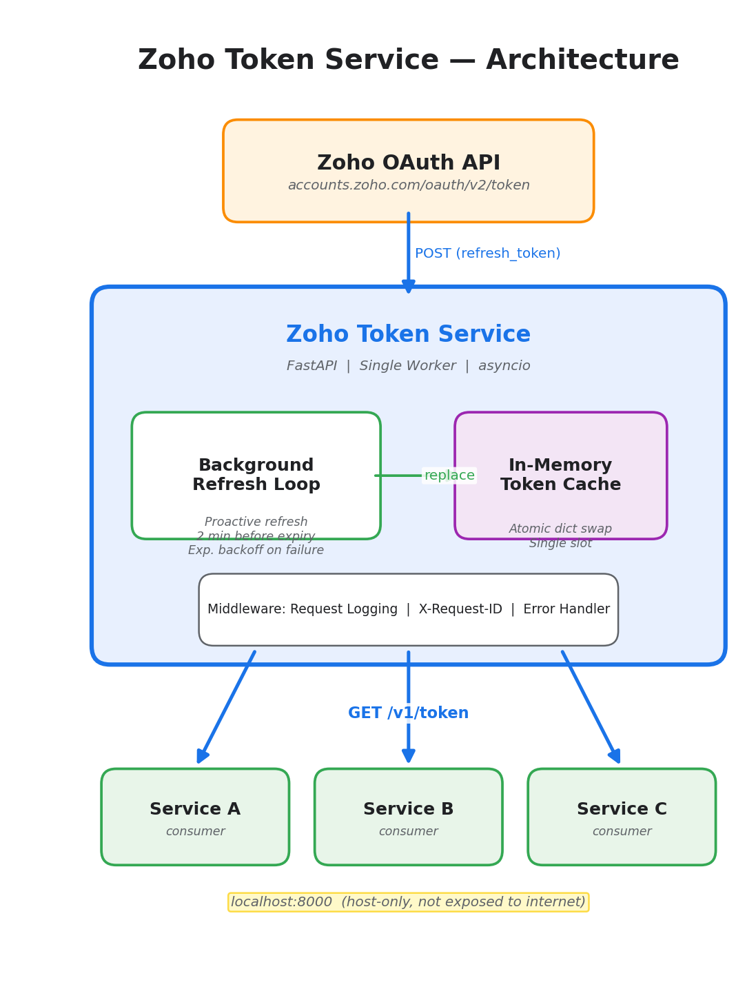
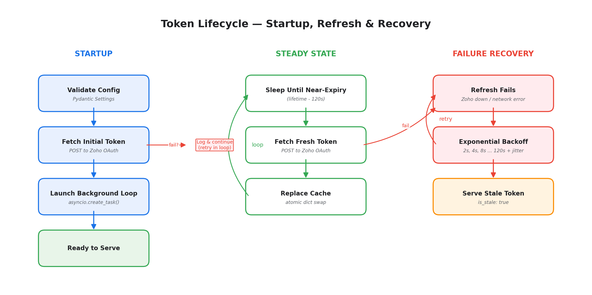
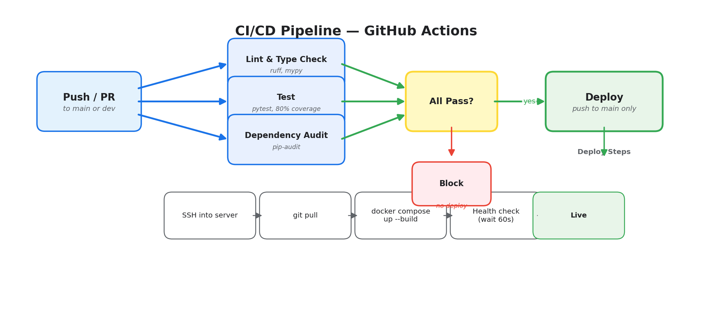

# Zoho Token Service

Internal microservice that caches Zoho OAuth access tokens and proactively refreshes them before expiry. Other services call a single endpoint to get a valid token — no need to manage refresh logic themselves.

## Architecture



## How It Works



1. **Startup** — validates all configuration via Pydantic Settings (fails fast on missing env vars), fetches the first token from Zoho, and launches the background refresh loop. If the initial fetch fails, the service starts anyway and retries in the background.
2. **Serving** — `GET /v1/token` returns the cached token instantly from memory. No Zoho API call on the hot path.
3. **Proactive refresh** — a background asyncio task sleeps until 2 minutes before the token expires (configurable), then fetches a new one. The old cache dict is replaced atomically in a single assignment.
4. **Failure recovery** — on refresh failure, the service uses exponential backoff with jitter (2s base, 120s max, both configurable) and retries indefinitely. Expired tokens are still served with `is_stale: true` so consumers can decide whether to use them.
5. **Shutdown** — the background task is cancelled cleanly via the FastAPI lifespan.

## API

All endpoints are available under `/v1/` (recommended) and at the root for backward compatibility.

| Endpoint | Alias | Method | Description |
|---|---|---|---|
| `/v1/token` | `/token` | GET | Returns the cached access token. **503** if no token has been fetched yet. |
| `/v1/readyz` | `/readyz`, `/health` | GET | Readiness probe — reports token status and refresh loop health. |
| `/v1/healthz` | `/healthz` | GET | Liveness probe — always **200**. |

Interactive API docs are available at `/docs` (Swagger UI) when the service is running.

### `GET /v1/token`

```json
{
  "access_token": "1000.xxxx...",
  "created_at": "2026-04-04T12:00:00+00:00",
  "expires_at": "2026-04-04T13:00:00+00:00",
  "token_type": "Zoho-oauthtoken",
  "is_stale": false
}
```

Response headers include `Cache-Control: private, max-age=N` (where N is the lesser of seconds until expiry or 60) and `X-Request-ID` for correlation.

When the token has expired but no fresh one is available, the endpoint still returns **200** with `"is_stale": true` instead of failing — consumers can decide whether to use it.

Returns **503** only if no token has ever been fetched (service still starting).

### `GET /v1/readyz`

```json
{
  "status": "ok",
  "token_cached": true,
  "token_is_stale": false,
  "expires_at": "2026-04-04T13:00:00+00:00",
  "refresh_loop_alive": true,
  "last_refresh_success": "2026-04-04T12:00:00+00:00"
}
```

Returns `"status": "degraded"` when the token is stale, missing, or the refresh loop is dead. Always returns **200** — use the `status` field to determine readiness.

### `GET /v1/healthz`

Always returns **200** with `"status": "ok"`. Use this for liveness probes (is the process alive?).

## Setup

### Prerequisites

- Python 3.12+
- [uv](https://docs.astral.sh/uv/) package manager

### Environment Variables

Copy the template and fill in your credentials:

```bash
cp .env.example .env
```

| Variable | Required | Default | Description |
|---|---|---|---|
| `ZOHO_REFRESH_TOKEN` | Yes | — | Zoho OAuth refresh token |
| `ZOHO_CLIENT_ID` | Yes | — | Zoho OAuth client ID |
| `ZOHO_CLIENT_SECRET` | Yes | — | Zoho OAuth client secret |
| `ZOHO_ACCOUNTS_TOKEN_URL` | No | `https://accounts.zoho.com/oauth/v2/token` | Zoho OAuth endpoint |
| `TOKEN_LIFETIME_SECONDS` | No | `3600` | Token validity duration (seconds) |
| `PROACTIVE_REFRESH_SECONDS` | No | `120` | How many seconds before expiry to refresh |
| `RETRY_BACKOFF_BASE_SECONDS` | No | `2.0` | Base delay for exponential backoff on failure |
| `RETRY_BACKOFF_MAX_SECONDS` | No | `120.0` | Maximum backoff delay |
| `LOG_LEVEL` | No | `INFO` | Logging level (DEBUG, INFO, WARNING, ERROR) |
| `LOG_FORMAT` | No | `json` | Log format: `json` (structured) or `text` (human-readable) |

### Local Development

```bash
uv sync --all-extras              # Install all dependencies including dev tools
uv run uvicorn app.main:app --host 0.0.0.0 --port 8000 --workers 1
```

### Running Tests

```bash
uv run pytest tests/ -v --cov=app --cov-report=term-missing
```

### Linting & Type Checking

```bash
uv run ruff check app/ tests/     # Lint
uv run ruff format --check app/ tests/  # Format check
uv run mypy app/                  # Type check
```

## Docker

### Build and Run

```bash
docker compose up --build -d
```

The service binds to `127.0.0.1:8000` (host-only, not exposed to the internet). A health check pings `/readyz` every 30 seconds.

The container runs as a non-root user (`appuser`) and uses a multi-stage build to minimize image size.

### Why `--workers 1`?

The token cache is an in-memory Python dict. Multiple Uvicorn workers would each maintain their own independent cache, causing N parallel refresh calls to Zoho instead of one. A single worker is intentional.

## Project Structure

```
zoho_token_service/
  app/
    __init__.py
    config.py             # Pydantic Settings — validated config from env vars
    logging_config.py     # Structured JSON / text logging setup
    main.py               # FastAPI app, versioned endpoints, global error handler
    middleware.py          # Request logging middleware, X-Request-ID correlation
    schemas.py            # Pydantic response models with OpenAPI metadata
    token_manager.py      # Token cache, background refresh loop, health tracking
  tests/
    conftest.py           # Shared fixtures (dummy env vars, settings cache clear)
    test_api.py           # HTTP endpoint tests (41 tests total across all files)
    test_config.py        # Config validation tests
    test_token_manager.py # Core refresh logic tests, edge cases
  .env.example            # Environment variable template
  Dockerfile              # Multi-stage build, non-root user, OCI labels
  docker-compose.yml      # Container orchestration with health checks
  pyproject.toml          # Dependencies, dev tools config (ruff, mypy, pytest)
  .github/
    workflows/
      ci.yml              # Lint, test, audit, deploy pipeline
```

## CI/CD

The GitHub Actions workflow runs on every push and pull request with four jobs:



## Observability

- **Structured logging** — JSON format by default (configurable to `text` for local dev). All log entries include timestamp, level, logger name, and message. Request logs include the correlation ID.
- **Request correlation** — every response includes an `X-Request-ID` header. If the caller sends one, it's echoed back; otherwise a UUID is generated. Logged with every request.
- **Health probes** — `/v1/readyz` reports token freshness, refresh loop status, and last successful refresh time. `/v1/healthz` is a simple liveness check.
